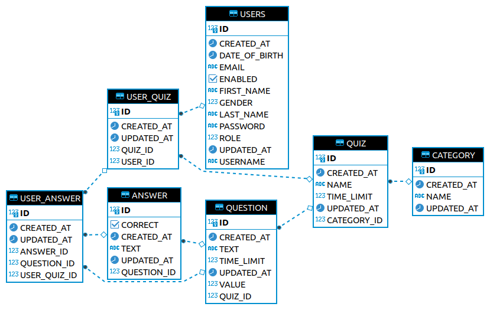
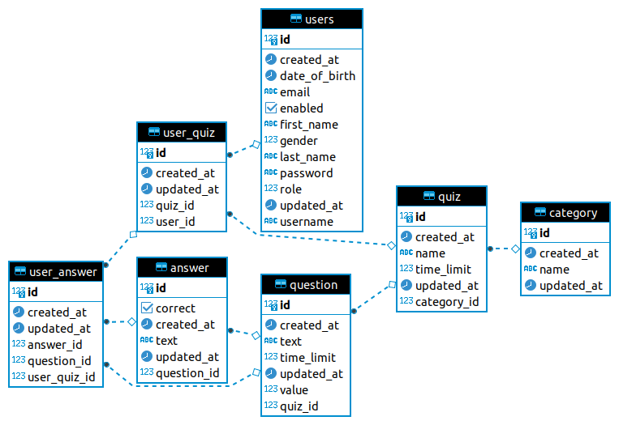

# Quiz API

[](https://github.com/orbanszlrd/quiz-api/actions/workflows/maven.yml)
[](https://github.com/orbanszlrd/quiz-api/actions/workflows/codeql-analysis.yml)

## Description

Simple API written in Java using Spring Boot and a Relational Database.

## Website URLs

[orbanszlrd-quiz.herokuapp.com](https://orbanszlrd-quiz.herokuapp.com)   
[quiz.dinodev.hu](http://quiz.dinodev.hu)  

## API Endpoints

1) The User API
   - POST /api/v1/users Add a new user.
   - GET /api/v1/users Retrieve all users.
   - GET /api/v1/users/{id} Get a user by its id.
   - PUT /api/v1/users/{id} Update a user by its id.
   - DELETE /api/v1/users/{id} Delete a user by its id

1) The Category API
    - POST /api/v1/categories Add a new category.
    - GET /api/v1/categories Retrieve all categories.
    - GET /api/v1/categories/{id} Get a category by its id.
    - PUT /api/v1/categories/{id} Update a category by its id.
    - DELETE /api/v1/categories/{id} Delete a category by its id

1) The Quiz API
    - POST /api/v1/quizzes Add a new Quiz.
    - GET /api/v1/quizzes Retrieve all Quizzes.
    - GET /api/v1/quizzes/{id} Get a Quiz by its id.
    - PUT /api/v1/quizzes/{id} Update a Quiz by its id.
    - DELETE /api/v1/quizzes/{id} Delete a Quiz by its id.

1) The Question API
    - POST /api/v1/questions Add a new Question.
    - GET /api/v1/questions Retrieve all Questions.
    - GET /api/v1/questions/{id} Get a Question by its id.
    - PUT /api/v1/questions/{id} Update a Question by its id.
    - DELETE /api/v1/questions/{id} Delete a Question by its id.

1) The Answer API
    - POST /api/v1/answers Add a new Answer.
    - GET /api/v1/answers Retrieve all Answers.
    - GET /api/v1/answers/{id} Get an Answer by its id.
    - PUT /api/v1/answers/{id} Update an Answer by its id.
    - DELETE /api/v1/answers/{id} Delete an Answer by its id.

## Database

The structure of the tables generated by Hibernate is slightly different.

### H2 Database



### PostgreSQL



### MariaDB


## Documentation

- http://localhost:8080/swagger-ui
- http://localhost:8080/api-docs
- http://localhost:8080/h2-console

## Development

### Prerequisites

Install the [OpenJDK](https://openjdk.java.net/install/).  
Install the [PostgreSQL](https://www.postgresql.org/https://www.postgresql.org/), an open source relational database.  
Install the [MariaDB](https://mariadb.org/download/), an open source relational database.  
Install [Git](https://git-scm.com/book/en/v2/Getting-Started-Installing-Git), the free and open source distributed version control system.
Install [Docker](https://docs.docker.com/get-docker/), an open source containerization platform.  
Install [Docker Compose](https://docs.docker.com/compose/install/), a tool for defining and running multi-container Docker applications.

### Recommended software

Install [IntelliJ IDEA](https://www.jetbrains.com/idea/download), or any other IDE for Java  
Install [DBeaver](https://dbeaver.io/download/), a free universal database tool and SQL client.  
Install [Postman](https://www.postman.com/downloads/), an API platform for building and using APIs.  

### Clone the project

Run `git@github.com:orbanszlrd/quiz-api.git` to clone the repository from [GitHub](https://github.com/orbanszlrd/quiz-api).

### Create a Database

After installing PostgreSQL or MariaDB, create a database for your project.

### Create the necessary Environment Variables

- PostgreSQL:

```text
SPRING_DATASOURCE_URL=jdbc:postgresql://<hostname>:5432/<dbname>
SPRING_DATASOURCE_USERNAME=<username>
SPRING_DATASOURCE_PASSWORD=<password>
```

- MariaDB:

```text
SPRING_DATASOURCE_URL=jdbc:mariadb://<hostname>:3306/<dbname>
SPRING_DATASOURCE_USERNAME=<username>
SPRING_DATASOURCE_PASSWORD=<password>
```

### Docker

- To build a docker image run  `./docker-image-builder.sh`  
- To run the app in a docker container run `./docker-container-runner.sh`
- The app will start running on `http://localhost:9090` and will use an embedded H2  database
- To run the app with PostgreSQL run `docker-compose up`
